<style>
    body {
        width: 80%;
    }

    .title {
        text-align: center;
        font-size: 38pt;
        font-weight: 300;
    }

    .spreadsheet iframe{
        width: 100%;
        height: 500px;
    }

    .thumbnail {
    position: absolute;
    top: 50%;
    left: 50%;
    width: 320px;
    height: 240px;
    
    -webkit-transform: translate(-50%,-50%); /* Safari and Chrome */
    -moz-transform: translate(-50%,-50%); /* Firefox */
    -ms-transform: translate(-50%,-50%); /* IE 9 */
    -o-transform: translate(-50%,-50%); /* Opera */
    transform: translate(-50%,-50%);
}

.image {
    margin: 0 auto;
    width: 100%;
    height: 100%;    
}

.image img {
    -webkit-transition: all 1s ease; /* Safari and Chrome */
    -moz-transition: all 1s ease; /* Firefox */
    -o-transition: all 1s ease; /* IE 9 */
    -ms-transition: all 1s ease; /* Opera */
    transition: all 1s ease;
}

.image:hover img {
    -webkit-transform:scale(1.5); /* Safari and Chrome */
    -moz-transform:scale(1.5); /* Firefox */
    -ms-transform:scale(1.5); /* IE 9 */
    -o-transform:scale(1.5); /* Opera */
     transform:scale(1.5);
}

.center {
    text-align: center;
}
</style>
<div class="center">
    
</div>
<div class="title">
    <p>Matriz de LED's - Linux x64 ASM</p>
</div>

---

## Introducción
El proyecto de la matriz de LED's consta de la construcción de la misma, así como de su control por medio del puerto **Serial** del Arduino y un programa hecho en ensamblador de 64 bits para **Linux**:

* Arduino con 12 salidas (Para este caso se empleó el **[Arduino Mega 2560](https://www.arduino.cc/en/Main/ArduinoBoardMega2560)**)
* 8 LED's por Fila, 8 Filas: **64 LED's en total**
* Registro de desplazamiento de 8 bits <a href="#" onclick="window.open('assets/74hc595.pdf');">**74HC595**</a>
* Arreglo de Transistores Darlington <a href="#" onclick="window.open('assets/uln2803a.pdf');">**ULN2803A**</a>
* Tablilla Preperforada
* 8 Resistencias de **220Ω**

##### Notas
**_Tanto los LED's como la tablilla podrían no ser necesarios si se tiene una Protoboard lo suficientemente grande y se adquiere una matríz prefabricada de LED's_**  
## Teoría básica sobre el funcionamiento
La función principal de una matriz de LED's es común: _desplegar algo_. Puede ir desde una simple figura o hasta un patrón o texto que va de derecha a izquierda (o viceversa).

El elemento importante es el registro de desplazamiento **74HC595**, el cual es un circuito integrado del tipo **SIPO** (_serial in, parallel out_).
Este actuará como una memoria temporal de **8 bits**, **1 bit para cada LED**. 

Esto, sumado a un procedimiento común de manejar las matrices de LED's, conocido como _escaneo_ y un _defecto humano_ conocido como [**persistencia de visión**](https://es.wikipedia.org/wiki/Persistencia_de_la_visi%C3%B3n) hacen que parezca que combinados, la matriz está encendida en su totalidad siempre, pero eso no es así.

### Acerca del Registro

El registro tiene un comportamiento similar al siguiente diagrama:
<div class="center image">
    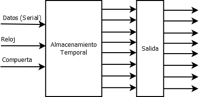
</div>

Esto indica que el registro recibirá el byte a desplegar para cada fila, y así lograr, junto con la combinación de las otras técnicas anteriormente mencionadas, una **memoria de video de 8 bytes** (_un byte por fila_).

El encargado de controlar que fila está activa para el proceso de escaneo, es el circuito **ULN2803A**, el cual es un arreglo de transistores Darlington, el cual se encargará de, dada la señal, poner a tierra la fila indicada, ya que el registro le inyecta el voltaje, así pues, estando a tierra, la fila enciende.


### Ejemplo de encendido

Supongamos que el registro recibe el byte ``B10011001``, esto hará que la fila activada en el momento, encienda de la siguiente manera:  
<div class="center image">
    
</div>

Así pues, al recibir una secuencia completa de 64 bits, encendería de la siguiente manera:  
<div class="center image">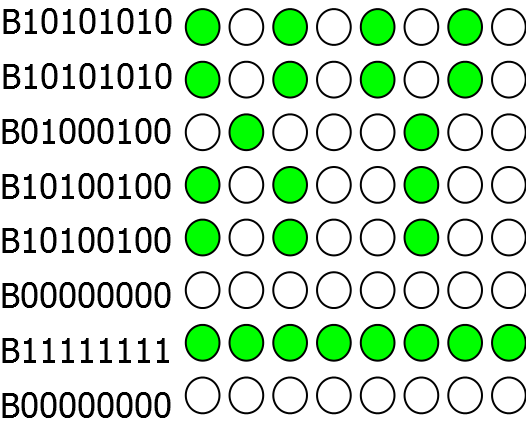</div>

# Construcción de la matriz

Si se ha optado por construir la matriz, se puede usar el siguiente diagrama como referencia para interconectar los LED's:  
<div class="center image">
    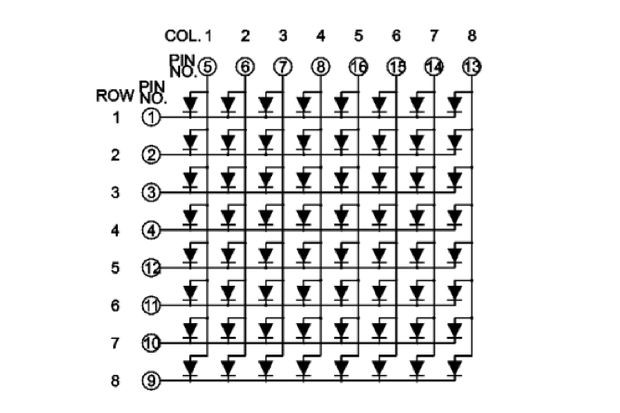
</div>
Se ha usado este diagrama para diseñar la matriz de LED's que se mostrará más adelante.

### Soldando la matriz
---
Primero se va soldando fila a fila, procurando que los cátodos queden todos en serie, mientras que los ánodos de cada columna también irán en serie:
<div class="center image">
    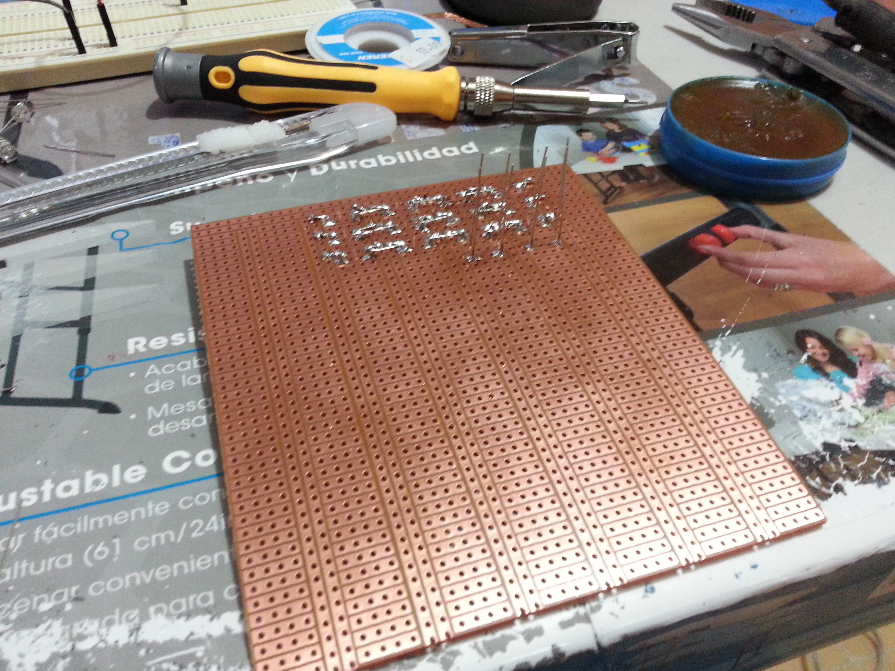
</div>
<div class="center image">
    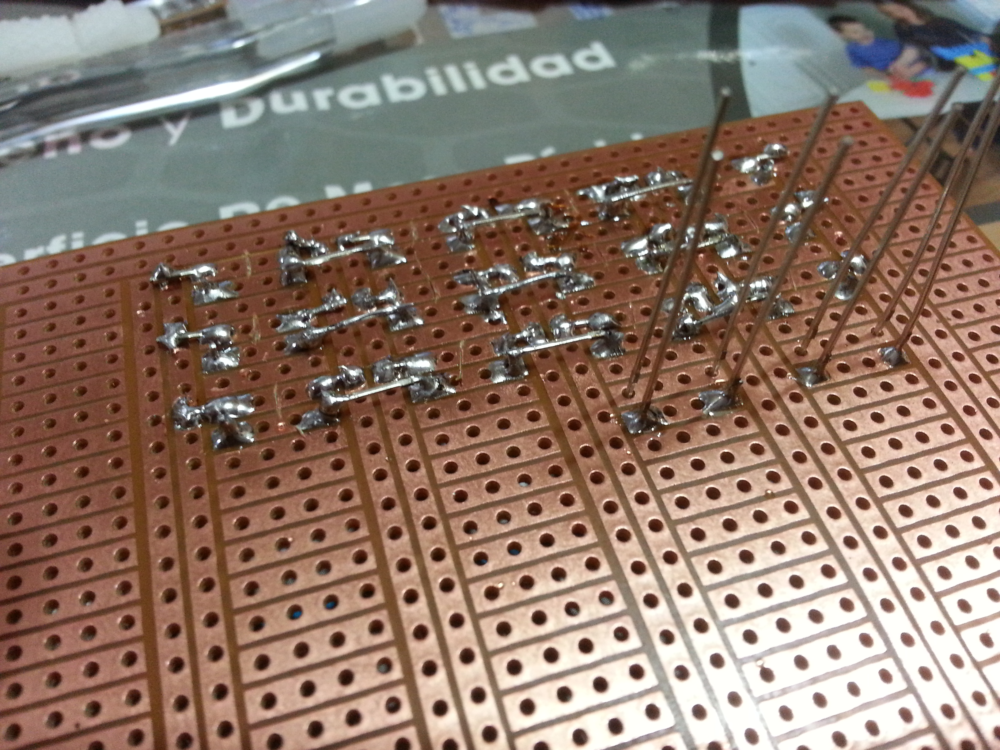
</div>
<div class="center image">
    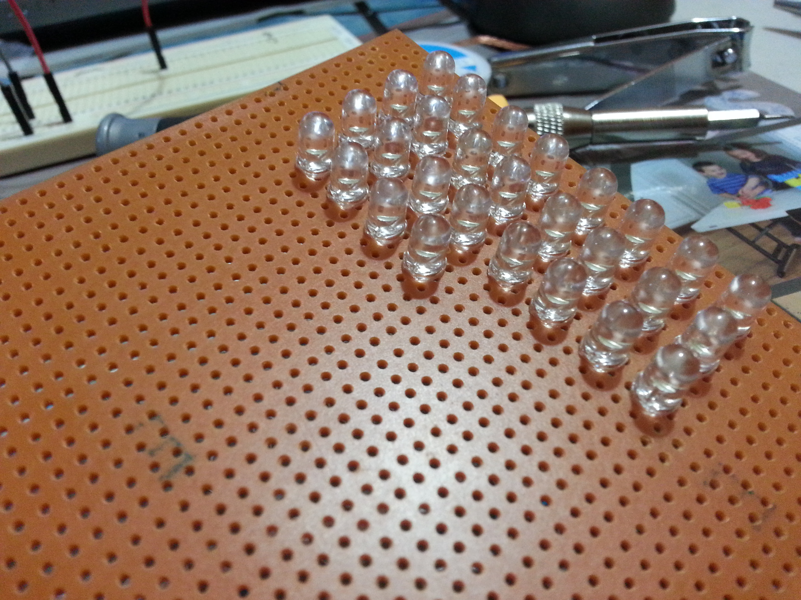
</div>
### Interconexiones
---
Se ha tomado como ejemplo [este diagrama](http://embedded-lab.com/blog/making-a-8x40-led-matrix-marquee-using-shift-registers/) que muestra como conectar **5 matrices de LED's** a diferentes registros y usando un sólo arreglo darlington para controlarlos, logicamente para este proyecto se simplificó a 1 matriz:  
<div class="center image">
    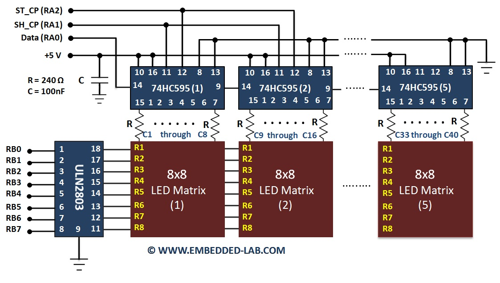
</div>

Se siguió el mismo esquema:  

+ Conectar las salidas del registro a los pines de las columnas de la matriz previamente construida, en serie con las resistencias para evitar quemar los LED's, ya que la salida de voltaje del registro es de **5v**.
+ Conectar los pines del arreglo a los pines de las filas de la matriz.
+ Soldar las conexiones de los pines del registro a unos cables para poder conectarlos al Arduino

### 74HC595: Pines a usar
El registro cuenta con unos pines que tienen sus características designadas:  

+ **Entrada de datos (SI)** - Por aquí recibe de manera serial los datos a almacenar
+ **Reloj (SCK)** - Controla la entrada de información, leyendo un bit en cada estado de **high**
+ **Activar salida (OE)** - Este es activo a tierra, lo que quiere decir que habilitará que lo que esté almacenado en el registro al estar de esa manera.
+ **Reset (SCLR)** - Reinicia el valor que tenga almacenado el registro
+ **Reloj de salida (RCK)** - Este controla el paso de la información del almacenamiento interno a la salida paralela del mismo
<div class="center image">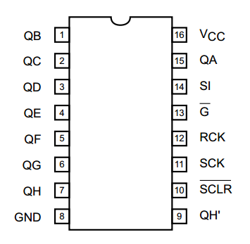</div>

### ULN2803A: Pines a usar
Prácticamente se emplearán todos los pines disponibles, debido a que tenemos 8 tierras, y cada una va conectada a cada salida del mismo.  
<div class="center image">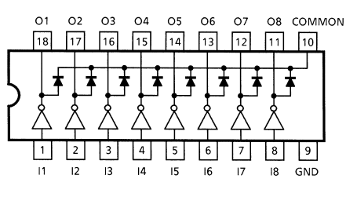</div>

+ **I1 - I8** - Estas entradas van a las salidas configuradas en el Arduino, son las que se encargarán de alternar las filas
+ **O1 - O8** - Cada uno a los pines de fila de la matriz (_cátodos_)
+ **COMMON** - Este pin se deja sin soldar, ya que es empleado cuando se manejan motores
+ **GND** - Soldado a tierra

### ¿Cómo queda todo conectado?

#### Registro
<div class="center image"></div>  
#### Arreglo
<div class="center image">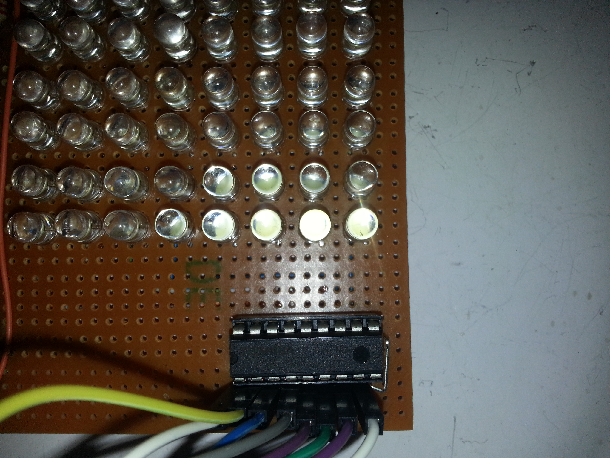</div>
<div class="center image">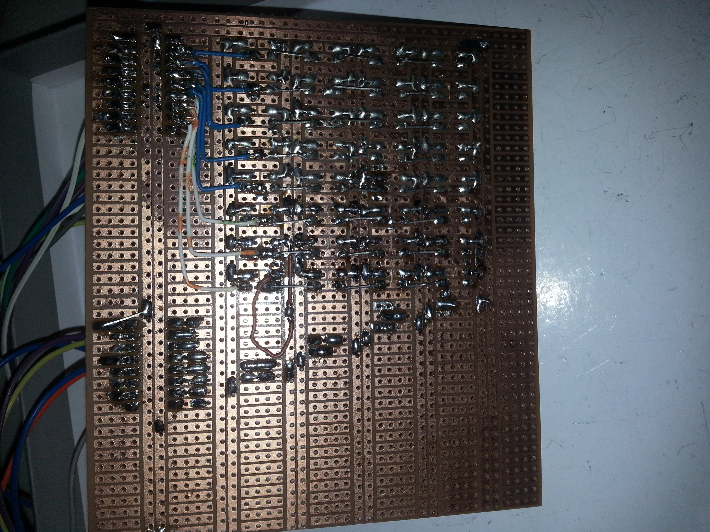</div>

# Código Arduino

El Arduino estará configurado de una manera muy simple, donde prácticamente sólo sirve como interfaz entre el registro y el programa en ASM.  
**El programa realiza lo siguiente:  **

+ Encender/Apagar filas
+ Enviar información al registro
+ Activar la salida del registro
+ Reiniciar el registro

#### Código

```C
// Pines para controlar el registro de corrimiento
#define dataPin 22
#define latchPin 23
#define clockPin 24
#define resetPin 7
// Pines para el ULN2803
#define row1 30
#define row2 31
#define row3 32
#define row4 33
#define row5 34
#define row6 35
#define row7 36
#define row8 37
#define dt 1

byte buffer[8] = {
  0x00,0x0E,0x11,0x03,0x0D,0x11,0x21,0x1F
  };

byte pos = 0;

int incomingByte = 0;

void updateRegister(byte data){
    resetRegister(0);
    digitalWrite(latchPin, LOW);
    shiftOut(dataPin, clockPin, LSBFIRST, data);
    digitalWrite(latchPin, HIGH);
}

void resetRegister(long dl){
    digitalWrite(resetPin, LOW);
    delay(dl);
    digitalWrite(resetPin, HIGH);
}

void enableRow(byte row){
    digitalWrite((30+row), HIGH);
}

void disableRows(){
    for(byte i = row1; i <= row8; i++) digitalWrite(i, LOW);
}

void setup()
{
    Serial.begin(9600);     // Inicia la comunicación serial a 9600bps
    // Configuramos los pines del Arduino como salidas
    for(int i=row1; i<=row8; i++){
        pinMode(i, OUTPUT);
    }
    pinMode(dataPin, OUTPUT);
    pinMode(latchPin, OUTPUT);
    pinMode(clockPin, OUTPUT);
    pinMode(resetPin, OUTPUT);
    resetRegister(0);    
}

void loop()
{
    if(buffer != NULL){
        for(pos = 0; pos <=7; pos++){
            disableRows();
            updateRegister(buffer[pos]);
            enableRow(pos);
            delay(dt);
        }
    }
    // Verifica si hay datos por recibir
    if (Serial.available() > 0) {
        // Leeremos 8 bytes dentro del buffeer
        int amount = Serial.readBytes(buffer, 8);
        if( amount < 8){
            for(int i = amount; i < 8; i++)
                buffer[i] = 0x00; // Poniendo a 0 los bytes incompletos
        }
    }
}

```

### Explicación
---
Esta sección se encarga de definir los pines que se emplearán para controlar la circuitería de la matriz:  

**Registro**
```C
// Pines para controlar el registro de corrimiento
#define dataPin 22
#define latchPin 23
#define clockPin 24
#define resetPin 7
```

**Arreglo**
```C
// Pines para el ULN2803
#define row1 30
#define row2 31
#define row3 32
#define row4 33
#define row5 34
#define row6 35
#define row7 36
#define row8 37
```

Cómo se estará escaneando la matriz, se define un tiempo. Esenciamente debería ser 0, para que el mismo microcontrolador trabaje el proceso a una velocidad de **16Mhz**, pero se le puso el retraso de **1ms** para hacer un poco más brillante la salida de los LED's
```
#define dt 1
```

Este código controla instrucciones básicas del registro, como **actualizar, reset**  
```
void updateRegister(byte data){
    resetRegister(0);
    digitalWrite(latchPin, LOW);
    shiftOut(dataPin, clockPin, LSBFIRST, data);
    digitalWrite(latchPin, HIGH);
}

void resetRegister(long dl){
    digitalWrite(resetPin, LOW);
    delay(dl);
    digitalWrite(resetPin, HIGH);
}
```

El siguiente código controla al arreglo para ir ciclando las filas  
```C
void enableRow(byte row){
    digitalWrite((30+row), HIGH);
}

void disableRows(){
    for(byte i = row1; i <= row8; i++) digitalWrite(i, LOW);
}
```

Aquí el primer método lo que hace es configurar al Arduino y sus pines en sus modos correspondientes, tal como **salida** y manda un pulso de reinicio al registro.  
El segundo bloque es el ciclo que está ejecutando el Arduino, el cual está mostrando en la matriz la información en el buffer y esperando a recibir más información por medio de la comunicación serial

```C

void setup()
{
    Serial.begin(9600);     // Inicia la comunicación serial a 9600bps
    // Configuramos los pines del Arduino como salidas
    for(int i=row1; i<=row8; i++){
        pinMode(i, OUTPUT);
    }
    pinMode(dataPin, OUTPUT);
    pinMode(latchPin, OUTPUT);
    pinMode(clockPin, OUTPUT);
    pinMode(resetPin, OUTPUT);
    resetRegister(0);    
}

void loop()
{
    if(buffer != NULL){
        for(pos = 0; pos <=7; pos++){
            disableRows();
            updateRegister(buffer[pos]);
            enableRow(pos);
            delay(dt);
        }
    }
    // Verifica si hay datos por recibir
    if (Serial.available() > 0) {
        // Leeremos 8 bytes dentro del buffeer
        int amount = Serial.readBytes(buffer, 8);
        if( amount < 8){
            for(int i = amount; i < 8; i++)
                buffer[i] = 0x00; // Poniendo a 0 los bytes incompletos
        }
    }
}
```

# Ensamblador

Para esto, se manejó ensamblador en **Linux x64**  para hacer de esto más fácil, ya que es menos restrictivo en cuanto al acceso de los puertos, como sabemos, en Linux todo es un archivo, y sólo basta con abrirlo para poder manipularlo.  En este caso, el archivo del Arduino es **/dev/ttyACM0**.

### Implementación de las letras
Antes que nada, el registro recibirá datos, **byte** para ser específico, entonces, lo que se quiera desplegar se tiene que **formatear** en ese espacio de información.  Como tenemos un espacio de 8 x 8, tenemos en total **64 bits**, o bien **8 bytes**, los cuales son más que suficientes para representar cómodamente letras en el clásico estilo de _8 bits_.  
Para esto, se creó por comodidad, una hoja de cálculo, la cual representa la matriz, y por medio de 0's los **LED's apagados** y 1's **LED's encendidos** respectivamente.  
<div class="spreadsheet">
    <iframe src="https://docs.google.com/spreadsheets/d/1lJLVQxV9emr97GJ1VcjLFo-Zj_EIf3d502triED3T_4/pubhtml?gid=203404913&amp;single=true&amp;widget=true&amp;headers=false"></iframe>
</div>  [**Descarga la hoja aquí**](https://docs.google.com/spreadsheets/d/1lJLVQxV9emr97GJ1VcjLFo-Zj_EIf3d502triED3T_4/edit?usp=sharing)  
Lo que hace la hoja es mapear cada fila a un byte en representación decimal, luego se convierte a hexadecimal y para finalizar, concatena los 8 bytes para darnos una representación, la cual podemos poner como información directamente en memoria para guardarlo y después poder enviarla al registro.

## Código

**Código Principal (main.asm)**

```nasm
; External imports
EXTERN print_stdout, read_keystroke, show_menu, clear_screen, open_file
EXTERN close_file, show_lmenu, open_file_parameter, write_to_fd, read_from_fd
EXTERN clean_stack, arduino_display_char, show_pmenu, arduino_display_pattern

; File handling things
%define RW          0q777   ; Octal CHMOD 777 (Read Write Execute)
%define O_WRONLY    1       ; Mode: Write only
%define O_RDWR      2       ; Mode: Read/Write

; Basic linux RAX syscall
%define SYS_EXIT    0x3c
%define SYS_WRITE   0x1
%define SYS_OPEN    0x2
; Basic File Descriptors
%define STDIN       0x0
%define STDOUT      0x1

section .data
    NEWLINE:    db  10
    ; Messages
    OK:         db  "Ok!", 10
    OKL:        equ $-OK
    ; Error Messages
    ENOFILE:    db  "Error al abrir (No existe o no tiene permisos)",10
    ENOFILES:   equ $-ENOFILE
    EINVCHAR:   db  "Caracter no reconocido, intente con letras o números",10
    EINVCHARS:  equ $-EINVCHAR

section .bss
    screen:         resb    8   ; 8 bytes reserved, 1 for each row
    screens:        equ     8   ; 8 bytes long, screen size (8 bits x 8 bits)
    keybuffer:      resb    2   ; 2 bytes for user input
    databuffer:     resb    128 ; 128 Buffer Bytes
    databuffers:    equ     128 ; Size of Buffer for reference
    ttyfd:          resb    8   ; 2 bytes for TTY File Descriptor
    bytesread:      resb    8

section .text

GLOBAL _start

; General Program
; Last modified: mié 25 may 2016 21:31:33 CDT

_start:
    nop
    ; Open TTY specified in parameters
    push ttyfd             ; FD Memory Address
    push O_RDWR            ; Flags
    push RW                ; Mode
    call open_file_parameter
    ; If FD is less than 0, no file was opened (error)
    cmp rax, 0
    jl _end_error          ; So we jump to exit
    ; Clean stack
    push 3
    call clean_stack
    ; Displays menu
    jmp display_menu
    nop

display_menu:
    call clear_screen
    call show_menu          ; Call procedure Show Menu
    ; read from stdin
    push keybuffer
    call read_keystroke
    menu_select:
        xor rax, rax            ; Clean RAX
        mov al, byte[keybuffer] ; Moves the key to the low register part
        cmp al, "p"             ; If p, pattern
        je pattern
        cmp al, "l"
        je letter               ; If l, letter
        cmp al, "q"             ; If the letter is q
        je _end                     ; Exit
    jmp display_menu        ; Else, show menu

pattern:
    ; Clean screen
    call clear_screen
    call show_pmenu
    .reading:
        push keybuffer          ; Pass Keybuffer 
        call read_keystroke     ; Call
    pattern_option:
        xor rax, rax
        mov al, byte[keybuffer]
        ; If ESC, menu
        cmp al, 0x1b
        je display_menu
        ; if less than 1, menu
        cmp al, "1"
        jl pattern
        ; If more than 3, menu
        cmp al, "3"
        jg pattern
        ; Else, display pattern
        push rax                    ; Letter/Number
        mov rbx, [ttyfd]
        push rbx                        ; Arduino TTY File Descriptor
        call arduino_display_pattern    ; Displaying things on screen 
        mov r12, rax                    ; Get error code
        ; Clean stack
        push 2
        call clean_stack
    jmp pattern

letter:
    ; Clean the screen
    call clear_screen
    call show_lmenu
    .reading:
        push keybuffer          ; Pass Keybuffer 
        call read_keystroke     ; Call
    letter_options:
        xor rax, rax
        mov al, byte[keybuffer]
        cmp al, 0x1b
        je display_menu
        ; If not ESC; let's show it in the matrix
        push rax                    ; Letter/Number
        mov rbx, [ttyfd]
        push rbx                    ; Arduino TTY File Descriptor
        call arduino_display_char   ; Displaying things on screen 
        mov r12, rax                ; Get error code
        ; Clean stack
        push 2
        call clean_stack
        ; Ok Message
        cmp r12, -1
        je error
        jmp letter.reading
        error:              ; Invalid Character
            push EINVCHAR
            push EINVCHARS
            call print_stdout
            push 2
            call clean_stack
            ; Clean STDIN reading from message (h4x)
            push STDIN
            push databuffer
            push databuffers
            call read_from_fd
            ; Clean stack
            push 3
            call clean_stack
        jmp letter.reading

_end_error:
    push ENOFILE
    push ENOFILES
    call print_stdout
    ; Cleaning stack
    pop rax
    pop rax
    xor rax, rax

_end:
    ; Close file
    mov r12, [ttyfd]
    push r12
    call close_file
    pop rax             ; Clean Stack
    mov rax, SYS_EXIT
    mov rdi, 0
    syscall 
```

**Procedimientos (procedures.asm)**
```nasm
;_______________________________________________________________________________
; General Procedures ASM file                                                  |
; Last Modified: mar 24 may 2016 13:42:48 CDT                                  |
; Author: José Carlos López Gaona                                              |
;                                                                              |
;                                                                              |
;______________________________________________________________________________|

; Basic linux RAX syscall'
%define SYS_EXIT    0x3c
%define SYS_READ    0x0
%define SYS_WRITE   0x1
%define SYS_OPEN    0x2
%define SYS_CLOSE   0x3
; Basic File Descriptors
%define STDIN       0x0
%define STDOUT      0x1
; 8 Bit size
%define CHARSIZE    64

section .data
    ; VT 100 control codes
    clear:      db      0x1b,"[2J"
    clearl:     equ     $-clear
    curhome:    db      0x1b,"[H"
    curhomel:   equ     $-curhome
    ; Menu
    menu:       db  "Matriz de LED's",10,"Elija una opción: ",10
    menus:      equ $-menu
    options:    db  "p. Patrón",10,"l. Letra",10,"q. Salir",10
    optionsl:   equ $-options
    ; Letter menu
    lmenu:      db  "Recibiendo entrada y enviando:",10
    lmenul:     equ $-lmenu
    ; Pattern Menu
    pmenu:      db  "Elija un patrón:",10,"1. Correo",10,"2. Pacman",10,"3. xD",10
    pmenul:     equ $-pmenu
    ; =========================================================================|
    ; ================================= 8 Bit Font ============================|
    ; =========================================================================|
    ; =================== Last Modified: mié 25 may 2016 15:33:24 CDT =========|
    ; Letters
    letter_array:
    a:          db       0x00,0x0E,0x11,0x03,0x0D,0x11,0x21,0x1F
    b:          db       0x20,0x20,0x20,0x3E,0x21,0x21,0x21,0x3E
    c:          db       0x00,0x00,0xFE,0x80,0x80,0x80,0x80,0xFF
    d:          db       0x01,0x01,0x1F,0x21,0x21,0x21,0x21,0x1F
    e:          db       0x00,0x00,0x3C,0x42,0x4C,0x50,0x60,0x3F
    f:          db       0x01,0x02,0x02,0x07,0x02,0x02,0x02,0x02
    g:          db       0xDE,0x22,0x22,0x3E,0x02,0x02,0x1C,0x00
    h:          db       0x10,0x10,0x10,0x1E,0x11,0x11,0x11,0x11
    i:          db       0x00,0x01,0x00,0x01,0x01,0x01,0x01,0x01
    j:          db       0x00,0x01,0x00,0x01,0x01,0x01,0x01,0x07
    k:          db       0x20,0x20,0x21,0x22,0x2C,0x30,0x2C,0x23
    l:          db       0x00,0x02,0x02,0x02,0x02,0x02,0x02,0x01
    m:          db       0x00,0x00,0x3A,0x25,0x25,0x25,0x25,0x25
    n:          db       0x00,0x3E,0x21,0x21,0x21,0x21,0x21,0x21
    o:          db       0x00,0x3E,0x41,0x41,0x41,0x41,0x41,0x3E
    p:          db       0x0E,0x11,0x11,0x1F,0x10,0x10,0x10,0x10
    q:          db       0x1C,0x22,0x22,0x26,0x1A,0x02,0x06,0x02
    r:          db       0x00,0x00,0x2E,0x31,0x20,0x20,0x20,0x20
    s:          db       0x00,0x00,0x1E,0x21,0x18,0x06,0x21,0x1E
    t:          db       0x08,0x08,0x08,0x1C,0x08,0x08,0x09,0x06
    u:          db       0x00,0x41,0x41,0x41,0x41,0x41,0x43,0x3D
    v:          db       0x00,0x00,0x21,0x11,0x11,0x0A,0x0A,0x04
    w:          db       0x00,0x00,0x29,0x29,0x29,0x29,0x29,0x16
    x:          db       0x00,0x00,0x21,0x12,0x0C,0x0C,0x12,0x21
    y:          db       0x00,0x11,0x11,0x0A,0x04,0x04,0x04,0x04
    z:          db       0x00,0x00,0x3F,0x01,0x06,0x18,0x20,0x3F
    letter_array_size:  equ     $-letter_array
    ; Numbers
    number_array:    
    zero:       db       0x1E,0x31,0x31,0x29,0x29,0x25,0x23,0x1E
    one:        db       0x00,0x00,0x02,0x06,0x02,0x02,0x02,0x07
    two:        db       0x00,0x00,0x06,0x09,0x01,0x06,0x08,0x0F
    three:      db       0x00,0x06,0x09,0x01,0x02,0x01,0x09,0x06
    four:       db       0x00,0x02,0x06,0x0A,0x1F,0x02,0x02,0x02
    five:       db       0x07,0x08,0x08,0x06,0x01,0x01,0x0E,0x00
    six:        db       0x06,0x08,0x08,0x06,0x09,0x09,0x09,0x06
    seven:      db       0x00,0x00,0x1F,0x01,0x02,0x04,0x08,0x10
    eight:      db       0x00,0x06,0x09,0x09,0x06,0x09,0x09,0x06
    nine:       db       0x00,0x06,0x09,0x09,0x07,0x01,0x01,0x01
    numbersize: equ      $-number_array
    ; Special
    special_array:
    mail:       db       0xFF,0x81,0xC3,0xA5,0x99,0x81,0x81,0xFF
    pacman:     db       0x00,0x00,0x00,0x91,0x11,0x0A,0x8A,0x04
    xD:         db       0x00,0x0E,0xA9,0xA9,0x49,0xA9,0xAE,0x00
    special_array_size: equ     $-special_array
    ;===========================================================================

section .bss
    stack_offset:   equ     8   ; Size of the stack, in this case, 8 bytes
    charsize:       equ     8   ; Size of a character

section .text

GLOBAL print_stdout, read_keystroke, show_menu, clear_screen, open_file
GLOBAL close_file, show_lmenu, open_file_parameter, write_to_fd, read_from_fd
GLOBAL clean_stack, arduino_display_char, show_pmenu, arduino_display_pattern
; Print Procedure - C Standard Parameters Handle (all in stack)
; mar 24 may 2016 13:42:35 CDT
; Receives (in order):
;   - Text to print
;   - Text size

print_stdout:
    mov rax, SYS_WRITE
    mov rdi, STDOUT                 ; File Descriptor
    mov rdx, [rsp+stack_offset]     ; Text size (bytes)
    mov rsi, [rsp+stack_offset*2]   ; Memory address of text
    syscall
    ret

; Reads a keystroke and writes it to memory
; mar 24 may 2016 13:42:30 CDT
; Receives:
;   - Char buffer memory address
; Modifies:
;   - Char buffer memory

read_keystroke:
    mov rax, SYS_READ
    mov rdi, STDIN
    mov rsi, [rsp+stack_offset]         ; Moves address to register
    mov rdx, 2                          ; Reads 2 bytes (Keystroke + Newline)
    syscall
    ret

; Displays the menu on screen
; mar 24 may 2016 13:42:24 CDT
; Receives:
;   - Nothing
; Returns:
;   - nothing
; Modifies:
;   - RAX

show_menu:
    push menu
    push menus
    call print_stdout
    pop rax
    pop rax
    push options
    push optionsl
    call print_stdout
    pop rax
    pop rax
    xor rax, rax
    ret

; Displays the letter menu, where we receive the input
; Last modified: mié 25 may 2016 21:33:56 CDT
; Receives:
;   - nothing
; Modifies:
;   - RAX

show_lmenu:
    push lmenu
    push lmenul
    call print_stdout
    pop rax
    pop rax
    xor rax, rax
    ret

; Displays the pattern Menu, where we receive the input
; Last modified jue 26 may 2016 05:59:12 CDT
; Receives: Nothing

show_pmenu:
    push pmenu
    push pmenul
    call print_stdout
    pop rax
    pop rax
    xor rax, rax
    ret

; Clears the screen
; Last Modified: mar 24 may 2016 13:47:32 CDT
; Receives:
;   - Nothing
; Returns:
;   - Nothing
; Modifies:
;   - RAX

clear_screen:
    push clear
    push clearl
    call print_stdout
    pop rax
    pop rax
    push curhome
    push curhomel
    call print_stdout
    pop rax
    pop rax
    xor rax, rax
    ret

; Builds the pattern to the memory address pointed
; Last modified: May, 24
; Receives (in order):
;   - "Video" memory address
; 
; Asks for user input for each pattern

build_pattern:
    ret

; Opens a file and saves the file descriptor to the address designed
; Last Modified: mié 25 may 2016 21:28:48 CDT
; Receives (in order):
;   - FD Memory Address
;   - Filename (memory address)
;   - Open Flags
;   - Mode
;  Modifies:
;   - RAX; RDX; RSI; RDI; R12
open_file:
    mov rax, SYS_OPEN
    mov rdx, [rsp+stack_offset]     ; Mode
    mov rsi, [rsp+stack_offset*2]   ; Flags
    mov rdi, [rsp+stack_offset*3]   ; Filename
    mov r12, [rsp+stack_offset*4]   ; FD Storage Address
    syscall
    mov [r12], rax                  ; Move new FD to memory
    ret

; Closes a file given the file descriptor
; Last modified: mié 25 may 2016 21:29:22 CDT
; Receives (in order):
;   - File Descriptor
close_file:
    mov rax, SYS_CLOSE              ; Close File Syscall
    mov rdi, [rsp+stack_offset]     ; File Descriptor
    syscall
    ret

; Opens a file within the first parameter given in the stack and saves it
;   to the designated memory address.
; Last Modified: mié 25 may 2016 21:38:42 CDT
; Receives:
;   - (6 in stack) Filename
;   - FD Memory Address
;   - Open Flags
;   - Mode
; Returns:
;   Nothing
; Modifies:
;   - RAX; RDX; RSI; RDI; R12

open_file_parameter:
    mov rax, SYS_OPEN
    mov rdx, [rsp+stack_offset]     ; Mode
    mov rsi, [rsp+stack_offset*2]   ; Flags
    mov r12, [rsp+stack_offset*3]   ; FD Storage Address
    mov rdi, [rsp+stack_offset*6]   ; Filename
    syscall
    mov [r12], rax                  ; Move new FD to memory
    ret

; Writes data to FD
; Last Modified: mié 25 may 2016 22:15:27 CDT
; Receives:
;   - Data address
;   - Size
;   - FD
; Returns:
;   Nothing
; Modifies:

write_to_fd:
    mov rax, SYS_WRITE              ; Write Syscall
    mov rdi, [rsp+stack_offset]     ; File Descriptor
    mov rdx, [rsp+stack_offset*2]   ; Size
    mov rsi, [rsp+stack_offset*3]   ; Data Address
    syscall
    ret

; Reads from FD and saves to specified buffer
; Last Modified: mié 25 may 2016 22:44:10 CDT
; Receives:
;   - FD
;   - Buffer Address
;   - Bytes to read
; Returns:
;   - nothing
; Modifies:
;   - RAX; RDX; RSI; RDI
read_from_fd:
    mov rax, SYS_READ
    mov rdx, [rsp+stack_offset]         ; Amount of bytes to read
    mov rsi, [rsp+stack_offset*2]       ; BUffer Address
    mov rdi, [rsp+stack_offset*3]       ; File Descriptor
    syscall
    ret

; Cleans the parameters passed in the stack (counting this call parameter)
; Last Modified: jue 26 may 2016 04:26:19 CDT
; Receives
;   - Parameter number to clean
; Returns
;   - Nothing
; Modifies:
;   - RAX, RBX, RCX
clean_stack:
    pop rax             ; Save Return Address
    pop rcx             ; Parameter number
    erase:
        pop rbx         ; Take out parameter
        dec rcx         ; Decrement counter
        cmp rcx, 0      ; Check if done
        jg erase
    push rax            ; Restore Return address
    ret

; Displays a predefined pattern on the led matrix
; Last modified: jue 26 may 2016 06:07:08 CDT
; Receives:
;   - Pattern (number)
;   - File Descriptor
; Options:
;   1. Correo
;   2. Pacman
;   3. xD
arduino_display_pattern:
    mov r12, [rsp+stack_offset]     ; FD
    mov rax, [rsp+stack_offset*2]   ; Move desired pattern to rax
    sub rax, 0x31                   ; Convert to number
    lea rbx, [special_array+(8*rax)]
    push rbx                            ; Pattern Effective Address
    push charsize                       ; Character Size
    push r12                            ; Arduino File Descriptor
    call write_to_fd
    ; Cleaning
    pop rax
    pop rax
    pop rax
    ret

; Shows a letter on the led matrix
; Last modified: jue 26 may 2016 04:50:59 CDT
; Receives:
;   - Letter to display
;   - File Descriptor of Arduino
; Returns:
;   - Nothing
; Modifies:

arduino_display_char:
    mov r12, [rsp+stack_offset]     ; FD
    mov rax, [rsp+stack_offset*2]   ; Move desired letter to RAX
    cmp rax, 97                     ; If letter is greater or equal than 97
    jge .display                         ; Display it
    ; Otherwise, it's maybe a number or a capital letter
    cmp rax, 65                     ; If it's a capital letter
    jge .lowercase                        ; make it lowercase
    ; Otherwise, maybe it's a number
    cmp rax, 48                     ; If it's a number
    jge .number                          ; Print it
    ; Otherwise, it's other thing and should be ignored
    jmp .asl_end

    .number:
        cmp rax, 57                         ; Check if valid number
        jg .asl_e_end                           ; NaN, error
        sub rax, 48                         ; Convert it to number
        lea rbx, [number_array+(8*rax)]     ; Load number effective address
        push rbx                            ; Number Effective Address
        push charsize                       ; Character Size
        push r12                            ; Arduino File Descriptor
        call write_to_fd
        jmp .asl_end
    .lowercase:
        cmp rax, 90                         ; Check if valid capital letter
        jg .asl_e_end                           ; If not, error
        add rax, 32                         ; Convert it to lowercase
    .display:
        cmp rax, 122                        ; Check if it's a valid letter
        jg .asl_e_end
        sub rax, 97                         ; Get letter offset
        lea rbx, [letter_array+(8*rax)]     ; Load letter effective address
        ; Writing out
        push rbx
        push charsize
        push r12
        call write_to_fd
        jmp .asl_end
    .asl_e_end:
        mov rax, -1
        ret
    .asl_end:
        ; Cleaning
        pop r12
        pop r12
        pop r12
        ret
```

Para ensamblar/enlazar el código, sólo tiene que tener la herramienta **make** y ejecutar en la terminal lo siguiente:  
```sh
make
```
Esto ejecutará el archivo **Makefile** que contiene lo siguiente:
```Makefile
main: main.o
    ld -o main main.o procedures.o
main.o: main.asm
    nasm -f elf64 -g -F stabs main.asm -l main.lst
    nasm -f elf64 -g -F stabs procedures.asm -l procedures.lst

clean:
    @rm -f *.o *.lst output
```
Este se encarga de ensamblar ambos archivos **.asm** y después los enlaza. 
## Ejecutando
El programa está configurado para ejecutarse de la siguiente manera:  
```
./main <ruta archivo puerto serial>
```
Por ejemplo, en mi caso, el archivo es **/dev/ttyACM0**:  
```
./main /dev/ttyACM0
```

En lo cual, se podrá controlar por medio de un menú sencillo la manipulación:  
<div class="center image"></div>

# Demostración

<div class="center">
    <video type="media/mp4" controls width="720p">
        <source src="assets/demo.mp4">
    </video>
</div>
